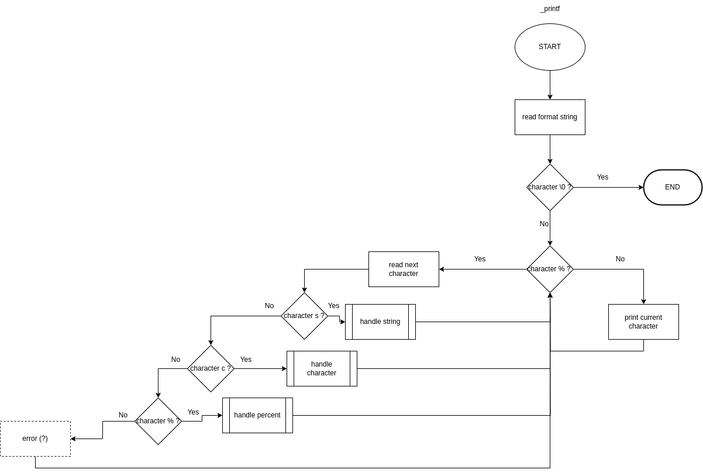

# _printf

## Description
A custom implementation of the C library function `printf`. This project is part of the Holberton School curriculum. It aims to replicate the behavior of the standard printf function, providing insight into its internal workings.

## installation
git clone https://{YOUR TOKEN}/pelcam/holbertonschool-printf.git

## Compilation
To compile this project, use the following command:
`gcc -Wall -Werror -Wextra -pedantic -std=gnu89 -Wno-format *.c`

## Requirements
- All files are compiled on Ubuntu 22.04 LTS using gcc
- Code adheres to the Betty coding style
- Follows the Betty style
- No use of global variables
- No more than 5 functions per file
- Prototypes of the functions are in the main.h header file

## Authorized Functions
- `write`
- `malloc`
- `free`
- `va_start`
- `va_end`
- `va_copy`
- `va_arg`

## examples of use
Here are some usage examples of `_printf`:
`_printf("Hello, %s!\n", "world");`  
`_printf("Character: %c\n", 'H');`

## features
- Supports format specifiers: `%c`, `%s`, `%i`, `%d`

## testing
To test the implementation, use the `main.c` file. Compile and run it as follows:
`gcc -Wall -Werror -Wextra -pedantic -std=gnu89 *.c -o test_printf`
`./test_printf`

## flowchart

## crew
Mariama Goudiaby et Camille Pelletier